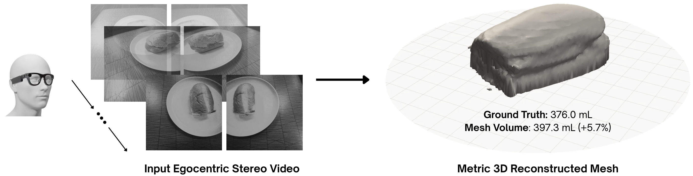

# Reference-Free Food Volume Estimation from Egocentric Stereo Video
Preprint (extended abstract) will be linked here shortly \
Author: Vivan Kumar, Purdue University

<p align="center">  </p>

## Abstract
Current stereo vision-based approaches for food portion estimation are hindered by the user burden of using a mobile phone to capture multiple images or placing a reference object in the scene for scale calibration. As a step towards passive dietary intake monitoring, we introduce a method that uses stereo video from a wearable egocentric device to reconstruct food items in true physical scale to accurately estimate volume. By utilizing FoundationStereo for zero-shot stereo-matching, SAM 2 for food segmentation, and TSDF fusion over a set of keyframes, our method yields a visually and metrically accurate 3D mesh of any plated food item from a single stereo recording. We leverage the unique offerings of emerging egocentric wearables, such as a factory-calibrated stereo baseline and camera poses estimated on-device via visual-inertial odometry (VIO), to automatically reconstruct items without a scale reference object in the scene. We show strong initial volume estimation results across five recorded food items, achieving a mean absolute percentage error of 9.1%.

## Installation
Our method was built and tested with Python 3.11 on a single 16 GB NVIDIA Tesla T4 GPU. Any NVIDIA GPU (required) that fits FoundationStereo with ViT-L should work.

```bash
git clone https://github.com/vivankumarr/aria-food-volume.git
cd aria-food-volume
python -m venv .venv && source .venv/bin/activate
pip install -r requirements.txt
```

The functions to perform rectification on fisheye stereo image pairs and retrieve the FoundationStereo outputs come from a Project Aria Gen 2 tool repo (containing FoundationStereo as a submodule) made available by Meta Research:

```bash
git clone --recurse-submodules https://github.com/facebookresearch/projectaria_gen2_depth_from_stereo.git third_party/projectaria_gen2_depth_from_stereo
```

Download the FoundationStereo 23-51-11 model's checkpoint (`model_best_bp2.pth`) and config (`cfg.yaml`) from the [official repo](https://github.com/NVlabs/FoundationStereo) and move both files into a local `checkpoints/` directory. SAM 2 weights (`facebook/sam2.1-hiera-large`) are pulled from Hugging Face automatically when it is initialized.

You can override the default save folders above by running the following first:

```bash
export DEPTH_FROM_STEREO_DIR=/path/to/projectaria_gen2_depth_from_stereo
export FOUNDATION_STEREO_CKPT=/path/to/model_best_bp2.pth
```

## Run a Scan
**Data:** The five food recordings used in the paper are available on request by emailing me at kumar733@purdue.edu. The pipeline runs end-to-end using a single VRS recording file captured by the glasses. Camera poses are read from the visual-inertial odometry estimations in the file, which are computed on-device for every frame.


```
python src/run_scan.py --vrs data/apple.vrs --name apple --ground-truth 177.0  # Ground truth is in mL
```

This writes the reconstructed mesh to `runs/apple.ply` and the estimated volume to `runs/apple.json`. `--ground-truth` is optional and only adds the absolute and percentage errors to the JSON. `python src/eval.py` iterates over every record in `runs/` to produce final results such as mean absolute percentage error (MAPE).

**Recording Protocol:** Each recording must begin with the wearer's gaze resting on the food, and this first fixation allows us to leverage the Aria glasses' eye-tracking gaze estimation as a point prompt to segment the food and plate. Then the wearer walks two complete circles around the plate, one observing it from a high polar angle (~60°) and one from a lower (~30°) angle to cover the food's outer surface from a range of views. The food and plate should both remain stationary during the scan. 

The food segmentation prompt defaults to the wearer's gaze projected into the first keyframe, and the plate prompt is derived from it automatically. If gaze is unavailable for a recording, you can pass `--food-xy` and `--plate-xy` manually as *(x, y)*-coordinates in the image. 

Running with `--preview` writes the first keyframe with a pixel grid overlaid on it so you can read off prompt coordinates for the food and/or plate.

## Results

The ground truth volumes were obtained by water displacement. The following results were produced by `src/run_scan.py` on each food recording, followed by `src/eval.py`.

| Item | Ground Truth (mL) | Estimated (mL) | Error (%) |
| --- | ---: | ---: | ---: |
| Apple | 177.0 | 156.2 | −11.8 |
| Honey Bun | 219.0 | 190.9 | −12.8 |
| Pizza Slice | 141.0 | 125.2 | −11.2 |
| Sandwich | 189.0 | 196.6 | 4.0 |
| Sub Sandwich | 376.0 | 397.3 | 5.7 |
| **MAPE (%)** | | | **9.1** |

## Citation
Placeholder

## Acknowledgements
Thanks to the authors of [FoundationStereo](https://github.com/NVlabs/FoundationStereo), [SAM 2](https://github.com/facebookresearch/sam2), [Open3D](https://github.com/isl-org/Open3D), and Meta's [projectaria_tools](https://github.com/facebookresearch/projectaria_tools) for releasing their code. Thanks to the Video and Image Processing Laboratory (VIPER) at Purdue for access to the Project Aria Gen 2 glasses and guidance.